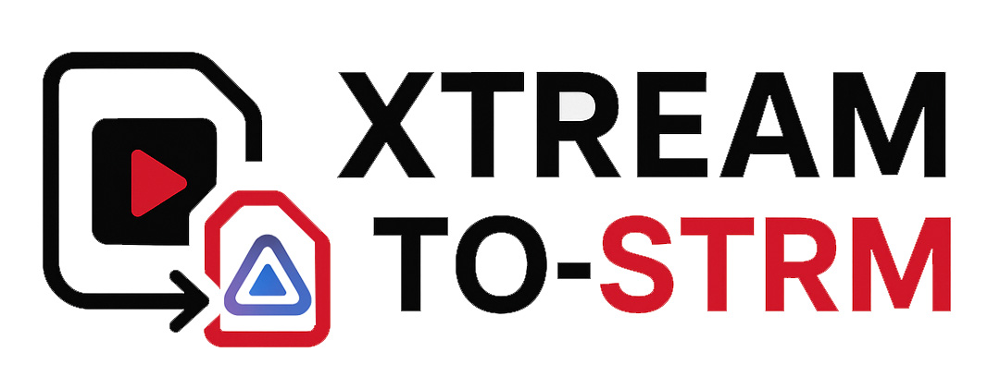

# Xtream to STRM

<div align="center">



**A modern web application for managing Xtream Codes and M3U playlists**  
Generate Jellyfin-compatible `.strm` and `.nfo` files for your media server

[](https://opensource.org/licenses/MIT)
[](https://hub.docker.com/r/mourabena2ui/xtream-to-strm-web)
[](https://hub.docker.com/r/mourabena2ui/xtream-to-strm-web)
[](https://github.com/mourabena2-ui/xtream-to-strm-web/releases)

</div>

---

## 🌟 Overview

Xtream to STRM is a complete, production-ready web application that transforms your Xtream Codes subscriptions and M3U playlists into **Jellyfin-compatible** media files. The application generates `.strm` stream files and `.nfo` metadata files following Jellyfin's naming conventions and folder structure, enabling seamless integration with your Jellyfin media server. Also compatible with Kodi and other media servers that support the same format.

Built with modern technologies, it provides an intuitive interface for managing your VOD content with advanced features like selective synchronization, intelligent metadata generation, and comprehensive administration tools.

## Fork Changes

This fork ([clive-stokes/xtream-to-strm-web](https://github.com/clive-stokes/xtream-to-strm-web)) adds the following enhancements over upstream:

### Core Improvements

| Change | Description | Files Modified |
|--------|-------------|----------------|
| **HTTP Redirect Support** | Adds `follow_redirects=True` to the Xtream API client, fixing providers that return 301 redirects | `backend/app/services/xtream.py` |
| **TMDB Folder Naming** | Appends `{tmdb-XXXXX}` to movie and series folder names when a valid TMDB ID is returned by the provider, enabling direct Jellyfin metadata matching instead of fuzzy name search | `backend/app/tasks/sync.py`, `backend/app/services/file_manager.py` |
| **Per-Movie Folders** | Movies with TMDB IDs are placed in their own subdirectory (e.g., `Superman {tmdb-812583}/Superman {tmdb-812583}.strm`) following Jellyfin's recommended naming convention | `backend/app/tasks/sync.py` |

### Enhanced NFO Generation

| Change | Description | Files Modified |
|--------|-------------|----------------|
| **Full Metadata NFOs** | NFO files now always include complete metadata (title, plot, year, genres, cast, ratings) alongside TMDB ID, not just the TMDB reference | `backend/app/services/file_manager.py` |
| **Episode NFO Generation** | Generates `<episodedetails>` NFO files for each episode with title, season/episode numbers, runtime, and stream details | `backend/app/services/file_manager.py`, `backend/app/tasks/sync.py` |
| **Kodi/Jellyfin Ratings Format** | NFOs include `<ratings>` block with TMDB rating in Kodi-compatible format | `backend/app/services/file_manager.py` |
| **User Rating Support** | Adds `<userrating>` element with integer rating (1-10 scale) | `backend/app/services/file_manager.py` |
| **MPAA Content Rating** | Adds `<mpaa>` element for content ratings when available | `backend/app/services/file_manager.py` |
| **Multiple Unique IDs** | NFOs include both `<uniqueid type="tmdb">` and `<uniqueid type="imdb">` when available | `backend/app/services/file_manager.py` |
| **Genre Separator Handling** | Genres are properly split on both comma and slash separators | `backend/app/services/file_manager.py` |

### Series Format Options

| Change | Description | Files Modified |
|--------|-------------|----------------|
| **Configurable Season Folders** | New setting `SERIES_USE_SEASON_FOLDERS` (default: true) - organize episodes into `Season XX` subfolders or keep flat | `backend/app/schemas.py`, `backend/app/tasks/sync.py` |
| **Series Name in Filename** | New setting `SERIES_INCLUDE_NAME_IN_FILENAME` (default: false) - prefix episode files with series name (e.g., `Series Name - S01E01 - Title.strm`) | `backend/app/schemas.py`, `backend/app/tasks/sync.py` |
| **Zero-Padded Season Folders** | Season folders use two-digit padding (`Season 01` not `Season 1`) for proper sorting | `backend/app/tasks/sync.py` |
| **Episode Title Cleaning** | Removes series name prefix and duplicate episode codes from provider titles to prevent filenames like `S01E01 - Show - S01E01 - Title.strm` | `backend/app/tasks/sync.py` |
| **Administration UI** | New checkboxes in Administration page for series format settings | `frontend/src/pages/Administration.tsx` |

### Admin & Cache Management

| Change | Description | Files Modified |
|--------|-------------|----------------|
| **Clear Movie Cache** | New endpoint `/admin/clear-movie-cache` to delete movie cache without affecting series | `backend/app/api/endpoints/admin.py` |
| **Clear Series Cache** | New endpoint `/admin/clear-series-cache` to delete series and episode cache without affecting movies | `backend/app/api/endpoints/admin.py` |
| **Reset Database (Preserves Config)** | Reset now preserves subscriptions and selections, only clears sync cache data | `backend/app/api/endpoints/admin.py` |
| **Defensive Episode Parsing** | Handles edge cases where Xtream API returns episode data as list instead of dict | `backend/app/services/file_manager.py` |

### Performance & Infrastructure

| Change | Description | Files Modified |
|--------|-------------|----------------|
| **Non-Root Container** | Container runs as user 1000:100 for better security and volume permissions | `Dockerfile.single`, `docker_start.sh` |
| **Parallel VOD Fetching** | Fetches detailed VOD info with 10 concurrent requests, reducing initial sync from ~25 hours to ~2-3 hours for large libraries | `backend/app/tasks/sync.py` |
| **Reduced Logging** | Suppresses verbose httpx HTTP request logs, keeping only progress messages | `backend/app/main.py`, `backend/app/core/celery_app.py` |

### Stream Details in NFO

| Change | Description | Files Modified |
|--------|-------------|----------------|
| **Video Stream Details** | NFO files include `<fileinfo><streamdetails>` with video codec, resolution, aspect ratio, duration, and bitrate | `backend/app/services/file_manager.py` |
| **Audio Stream Details** | Includes audio codec, channels, sample rate, layout, and language when available from provider | `backend/app/services/file_manager.py` |
| **Parallel Detail Fetching** | Fetches detailed info via `get_vod_info()` API for each movie during sync | `backend/app/tasks/sync.py` |

### UI Improvements

| Change | Description | Files Modified |
|--------|-------------|----------------|
| **Sync Progress Display** | Dashboard shows real-time sync progress with percentage, progress bar, phase, and item counts | `frontend/src/pages/Dashboard.tsx` |
| **Fixed Logs Page** | Fixed authentication token handling for live logs streaming | `frontend/src/pages/Logs.tsx` |
| **Progress API** | New fields in sync status API: `progress_current`, `progress_total`, `progress_phase` | `backend/app/schemas.py`, `backend/app/api/endpoints/sync.py`, `backend/app/models/sync_state.py` |

### NFO Format Details

**Movie NFO** (`movie.nfo`):
```xml
<?xml version="1.0" encoding="UTF-8"?>
<movie>
  <title>Movie Title</title>
  <originaltitle>Original Title</originaltitle>
  <year>2024</year>
  <plot>Movie description...</plot>
  <runtime>120</runtime>
  <mpaa>PG-13</mpaa>
  <genre>Action</genre>
  <genre>Drama</genre>
  <director>Director Name</director>
  <actor><name>Actor Name</name></actor>
  <ratings>
    <rating name="tmdb" default="true"><value>7.5</value></rating>
  </ratings>
  <userrating>8</userrating>
  <uniqueid type="tmdb" default="true">123456</uniqueid>
  <uniqueid type="imdb">tt1234567</uniqueid>
  <fileinfo>
    <streamdetails>
      <video>
        <codec>hevc</codec>
        <width>3840</width>
        <height>2160</height>
        <aspect>16:9</aspect>
        <durationinseconds>7260</durationinseconds>
        <bitrate>12500</bitrate>
      </video>
      <audio>
        <codec>eac3</codec>
        <channels>6</channels>
        <samplerate>48000</samplerate>
        <language>eng</language>
      </audio>
    </streamdetails>
  </fileinfo>
</movie>
```

**TV Show NFO** (`tvshow.nfo`):
```xml
<?xml version="1.0" encoding="UTF-8"?>
<tvshow>
  <title>Series Title</title>
  <year>2024</year>
  <plot>Series description...</plot>
  <genre>Drama</genre>
  <ratings>
    <rating name="tmdb" default="true"><value>8.2</value></rating>
  </ratings>
  <userrating>9</userrating>
  <mpaa>TV-MA</mpaa>
  <uniqueid type="tmdb" default="true">654321</uniqueid>
  <uniqueid type="imdb">tt7654321</uniqueid>
</tvshow>
```

**Episode NFO** (`S01E01 - Title.nfo`):
```xml
<?xml version="1.0" encoding="UTF-8"?>
<episodedetails>
  <title>Episode Title</title>
  <showtitle>Series Name</showtitle>
  <season>1</season>
  <episode>1</episode>
  <runtime>45</runtime>
  <plot>Episode description...</plot>
  <fileinfo>
    <streamdetails>
      <video>
        <codec>h264</codec>
        <width>1920</width>
        <height>1080</height>
      </video>
      <audio>
        <codec>aac</codec>
        <channels>2</channels>
      </audio>
    </streamdetails>
  </fileinfo>
</episodedetails>
```

### Series Format Examples

With default settings (`SERIES_USE_SEASON_FOLDERS=true`, `SERIES_INCLUDE_NAME_IN_FILENAME=false`):
```
Series Name {tmdb-123456}/
├── tvshow.nfo
├── Season 01/
│   ├── S01E01 - Episode Title.strm
│   └── S01E01 - Episode Title.nfo
└── Season 02/
    └── S02E01 - Another Episode.strm
```

With flat structure (`SERIES_USE_SEASON_FOLDERS=false`):
```
Series Name {tmdb-123456}/
├── tvshow.nfo
├── S01E01 - Episode Title.strm
├── S01E01 - Episode Title.nfo
└── S02E01 - Another Episode.strm
```

With series name prefix (`SERIES_INCLUDE_NAME_IN_FILENAME=true`):
```
Series Name {tmdb-123456}/
├── tvshow.nfo
└── Season 01/
    └── Series Name - S01E01 - Episode Title.strm
```

## ✨ Key Features

### 🎬 Multi-Source Support
- **Xtream Codes**: Full support for Xtream API with multi-subscription management
- **M3U Playlists**: Import from URLs or file uploads with group-based selection

### 🎯 Smart Synchronization
- **Selective Sync**: Choose specific categories or groups to synchronize
- **Incremental Updates**: Only sync what's changed since last update
- **Dual Control**: Separate sync for Movies and Series

### 📋 Rich Metadata
- **NFO Generation**: Detailed metadata files in Jellyfin format
- **TMDB Integration**: Automatic movie/series information enrichment
- **Configurable Formatting**: Title prefix cleaning, date formatting, and name normalization

### 🎨 Modern Interface
- **Responsive Design**: Works seamlessly on desktop and mobile
- **Real-Time Updates**: Live sync progress and status monitoring
- **Dark Mode**: Beautiful, comfortable viewing experience
- **Intuitive Navigation**: Clean organization with logical menu structure

### 🛠️ Advanced Administration
- **Database Management**: Easy reset and cleanup operations
- **File Management**: Bulk delete and reorganization tools
- **NFO Settings**: Customize title formatting with regex patterns
- **Statistics Dashboard**: Comprehensive overview of your content

## 🚀 Quick Start

### Installation from Docker Hub (Recommended)

```bash
docker run -d \
  -p 8000:8000 \
  -v $(pwd)/output:/output \
  -v $(pwd)/db:/db \
  --name xtream-to-strm \
  mourabena2ui/xtream-to-strm-web:latest
```

Access the web interface at **http://localhost:8000**

### Using Docker Compose

```yaml
version: '3.8'

services:
  app:
    image: mourabena2ui/xtream-to-strm-web:latest
    container_name: xtream_app
    ports:
      - "8000:8000"
    volumes:
      - ./output:/output
      - ./db:/db
    restart: unless-stopped
```

Then start with:
```bash
docker-compose up -d
```

## 📖 Usage

### 1. Add Your Content Source

**For Xtream Codes:**
- Navigate to **XtreamTV** → **Subscriptions**
- Add your subscription details (URL, username, password)
- Configure movie and series output directories

**For M3U Playlists:**
- Navigate to **M3U Import** → **Sources**
- Add source via URL or file upload
- Configure output directory

### 2. Select Content to Sync

**For Xtream:**
- Go to **XtreamTV** → **Bouquet Selection**
- List available categories
- Select categories for movies and/or series

**For M3U:**
- Go to **M3U Import** → **Group Selection**
- Select your source
- Choose groups for movies and/or series

### 3. Synchronize

Click **Sync Movies** or **Sync Series** to generate your files!

### 4. Configure Your Media Server

Point Jellyfin to the `/output` directory to scan your new content. The generated files follow Jellyfin's naming conventions for optimal recognition.

## 🎛️ NFO Configuration

Customize how titles are formatted in NFO files:

| Setting | Description | Example |
|---------|-------------|---------|
| **Prefix Regex** | Strip language/country prefixes | `FR - Movie` → `Movie` |
| **Format Date** | Move year to parentheses | `Name_2024` → `Name (2024)` |
| **Clean Name** | Replace underscores with spaces | `My_Movie` → `My Movie` |

Access these settings in **Administration** → **NFO Settings**

## 📁 Generated File Structure

```
output/
├── movies/
│   └── Category Name/
│       ├── Movie Name {tmdb-123456}/
│       │   ├── Movie Name {tmdb-123456}.strm
│       │   └── Movie Name {tmdb-123456}.nfo
│       └── Movie Without TMDB.strm      # flat if no TMDB ID
└── series/
    └── Category Name/
        └── Series Name {tmdb-654321}/
            ├── tvshow.nfo
            └── Season 01/
                └── S01E01 - Episode Title.strm
```

## 🔧 Technology Stack

- **Backend**: Python 3.11, FastAPI, SQLAlchemy, Celery
- **Frontend**: React 18, TypeScript, Vite, TailwindCSS
- **Infrastructure**: Redis, SQLite
- **Containerization**: Docker (multi-stage build)

## 📝 Version History

### v2.5.0 (Latest)
- ✨ Enhanced NFO title formatting options
- ✨ Configurable regex for prefix stripping
- ✨ Date formatting at end of titles
- ✨ Name cleaning (underscore replacement)
- 🎨 New application logo
- 🐛 Fixed config endpoint routing
- 🐛 Improved M3U sync with NFO generation

### v2.0.0
- ✨ Added M3U playlist support
- ✨ Refactored UI structure
- ✨ Split sync controls for Movies/Series
- 🎨 Enhanced dashboard and navigation

## 📄 License

This project is licensed under the MIT License - see the [LICENSE](LICENSE) file for details.

## 🤝 Contributing

Contributions are welcome! Please feel free to submit a Pull Request.

## 💬 Support

- **Issues**: [GitHub Issues](https://github.com/mourabena2-ui/xtream-to-strm-web/issues)
- **Docker Hub**: [mourabena2ui/xtream-to-strm-web](https://hub.docker.com/r/mourabena2ui/xtream-to-strm-web)

## ☕ Support This Project

If you find this project helpful, consider supporting its development!

<a href="https://www.buymeacoffee.com/mourabena" target="_blank"></a>

Your support helps maintain and improve this project. Thank you! 🙏

---

<div align="center">

**Made with ❤️ for the Jellyfin and Kodi community**

[Docker Hub](https://hub.docker.com/r/mourabena2ui/xtream-to-strm-web) • [GitHub](https://github.com/mourabena2-ui/xtream-to-strm-web)

</div>
